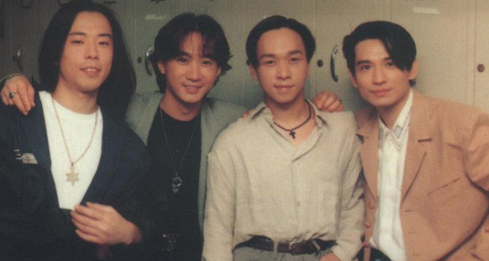
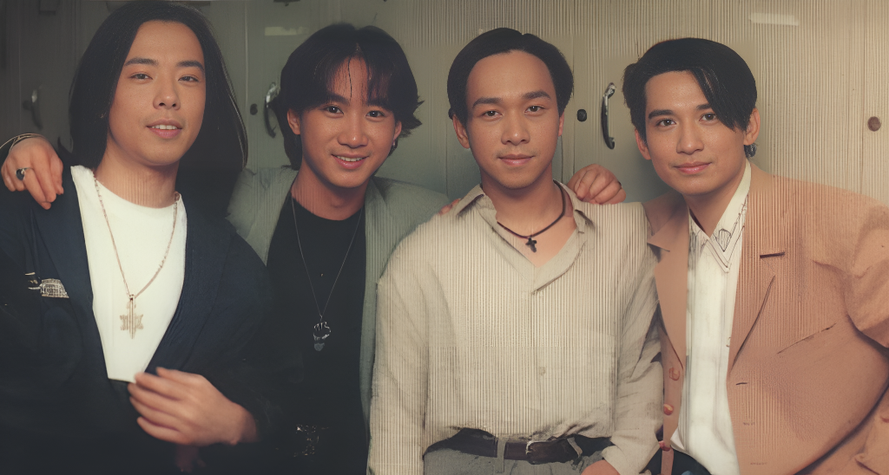

# CodeFormer-ncnn  
ncnn version of CodeFormer **Towards Robust Blind Face Restoration with Codebook Lookup Transformer**  

## model support:  
### 1.Face Restoration  

## Run  
### Face Restoration (cropped and aligned face)  
```
# For cropped and aligned faces
./ncnn_codeformer ./02.png 0
```
### Whole Image Enhancement  
```
# For whole image
./ncnn_codeformer ./02.png 1
```

## Result   
  
  
  
  

## Reference  
1.https://github.com/sczhou/CodeFormer  
2.https://github.com/xinntao/Real-ESRGAN  
3.https://github.com/FeiGeChuanShu/GFPGAN-ncnn  
4.https://github.com/Tencent/ncnn  
5.https://github.com/deepcam-cn/yolov5-face  